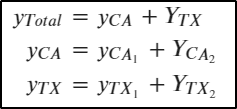
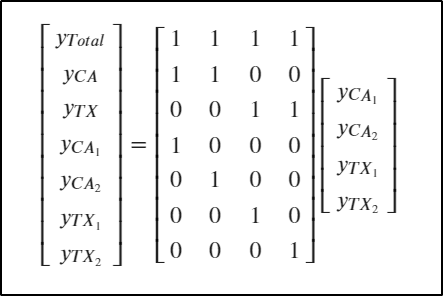
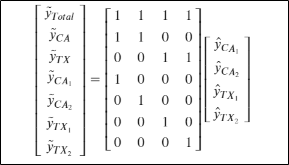
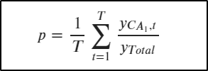
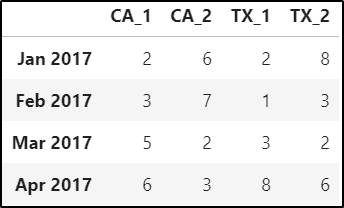
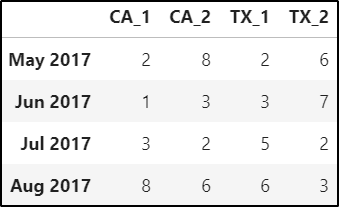
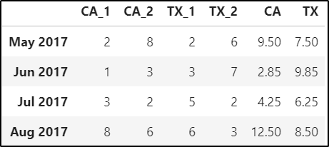

# Hierarchical time series

Contribiutors - @fkiraly, @mloning, @AngelPone, @aiwalter, @satya-pattnaik

## Introduction

A Time Series which follows an hierarchical aggreagted structure for example across geographical areas.
From Store Level to District Level to State Level and then Country Level. The following picture depicts such a hierarchy(insipred from [M5 Walmart Data](https://www.kaggle.com/c/m5-forecasting-accuracy)). 

<br>
The challenge lies in Forecasting across the geographical divisions with highest accuracy.

For any time **t**, the observations at the bottom level will sum up to series above,<br>

 <br>

 A more general form of representation will be:<br>
 

where **b<sub>t</sub>** are the base forecasts, **S** is the summation matrix and **$\tilde{y}_h$** the aggragated data.

The matrix form:<br>


## Approaches for Hierarchichal Forecasting

### The Bottom Up Approach

A simple method for generating coherent forecasts is the Bottom Up Approach.The coherent forecasts are produced by summing up the bottom level individual forecasts. To represent in Matrix notation:<br>


### The Top Down Approach
This involves generating forecasts at the top level and then disaggregating the forecasts to individual levels based on proportions.

A general notation for this will be

Based on the above example, for store CA_1 the forecast will be:<br>
<br>
where **p** is the historical proportion of sales at **CA_1 store**.
The computation of **p** can be done in two ways:
#### 1.Average historical proportions.
A general notation for this is<br>
<br>

where, **y<sub>j,t</sub>** is the historical value for bottom level series **j** at time **t** and<br> **y<sub>t</sub>** is the total aggregate, over the period t=1,2,...,T.<br><br>
For our example:<br>
<br> 
#### 2.Proportions of the historical averages.<br>
<br>

## The Optimal Reconciliation

Considering a more generalized form to represent Hierarchical Forecasts, the mapping matrices can be represented as:<br>
<br>
where **S** is summation matrix and *$\hat{y}$* are the set of base forecasts. The optimal reconciliation approach is about finding the optimal **G** matrix which in turn provides the most accurate coherent forecasts $\tilde{y}$.<br>

[More Reading](https://otexts.com/fpp2/reconciliation.html)


## API Design-Example Usage
**Load Time Series**

```
ts = load_data()
ts
```
<br>

**Aggregate Data**(For each state i.e CA and TX)
```
ts["CA"] = ts["CA_1"] + ts["CA_2"]
ts["TX"] = ts["TX_1"] + ts["TX_2"]
ts
```
<br>

**Create a Placeholder DataFrame for Forecasts**
```
forecasts = pd.DataFrame(columns=["CA_1","CA_2","TX_1","TX_2"],
                         index=["May 2017","Jun 2017","Jul 2017","Aug 2017"])
forecasts
```
**Use Sktime Forecasters for Base Forecasts**
```
from sktime.forecasting.all import *

for i in range(4):
    fh = ForecastingHorizon(forecasts.index, is_relative=False)
    forecaster = AutoARIMA()
    forecaster.fit(ts[:,i])
    forecasts.iloc[:,i] = forecaster.predict(fh) 

print(forecasts)
```

<br>

**Hierarchical Forecast Design Sketch**
(This will generate the coherent forecasts across the hierarchy)

Added the hierarchical_encoding part which I had missed(after suggestions from **@AngelPone** and **@fkiraly**)

```
hierarchical_encoding=create_hierarchical_encodings(df) #Added this part, which I had forgot in the initial sketch
hierarchical_reconciler = HierarchicalReconcile(hierarchical_encoding,method="ols")
hierarchical_reconciler.fit(ts)
coherent_forecasts = hierarchical_reconciler.predict(forecasts)
print(coherent_forecasts)
```
<br>

## Refined API Design Sketch(as per suggestions from @AngelPone) 
```
class BaseHierarchy():
    def aggregate_ts():
    # construct df used for generating base forecasts and reconciliation

class CrossSectionalHierarchy(BaseHierarchy):
    # classmethod used for construction of hierarchy from different abstract descriptions.
    @classmethod
    def from_xxx():
        return cls()

class TemporalHierarchy(BaseHierarchy):
    def __init__():

# Forecasters
def wls():

def mint():

class HierarchicalForecaster(BaseForecaster):
    def __init__(hierarchy, base_forecasters:Union[BaseForecaster|List|Dict], method="ols", 
                  weights=Optional[str])

    def _check_y_X():

    def _fit_forecasters(y, X, return_residuals=False):
    def _predict_forecasters(X):

    def _fit(y, X):
        df = self.hierarchy.aggregate_ts(y)

        if self.method=='ols':
            self._fit_forecasters(df, X)
            self.G_ = wls(self.hierarchy, weights=None)
        elif self.method == 'wls':
            self.G_ = wls(self.hierarchy, weights=weights)
        elif self.method == 'mint':
            residuals = self._fit_forecasters(df, X, True, weights=weights)
            self.G_ = mint(self.hierarchy, residuals)
        else:
            raise ValueError()

    def _predict(X):
        base_forecasts = self._predict_forecasters(X)
        reconciled_forecasts = self.G_.dot(base_forecasts)
        if isinstance(self.hierarchy, TemporalHierarchy):
            return reconciled_forecasts.flat()
        return reconciled_forecasts

```
### Use Case(Based on the above design)
```
y = load_data()
ht = Hierarchy.from_xxx()
hforecasters = HierarchicalForecaster(ht, method="ols", base_forecasters=AutoArima(sp=7))
hforecasters.fit(y)
reconciled_forecasts = hforecasters.predict([1])
```

### Modification to the Sketch(as per @mloning)
```
class BaseReconciler()
    def fit(...):
        ...

    def reconcile(...):
        ...
        
class OLS(BaseReconciler):
    ...

#Use case
ols = OLS()

y = load_data()
ht = Hierarchy.from_xxx()
hforecasters = HierarchicalForecaster(ht, method=ols, base_forecasters=AutoArima(sp=7))
hforecasters.fit(y)
reconciled_forecasts = hforecasters.predict([1])
```

## References
1. https://otexts.com/fpp2/hierarchical.html
2. [R Package](https://cran.r-project.org/web/packages/hts/index.html) 
3. [Python Package](https://pypi.org/project/scikit-hts/)

## Examples(Python Package)
1. [ScikitHTS Example](https://github.com/carlomazzaferro/scikit-hts)
2. [Example Notebook in Python](https://colab.research.google.com/drive/1thHtaUS-8boRRVqZ1pYiog8zpljndxAu?usp=sharing)